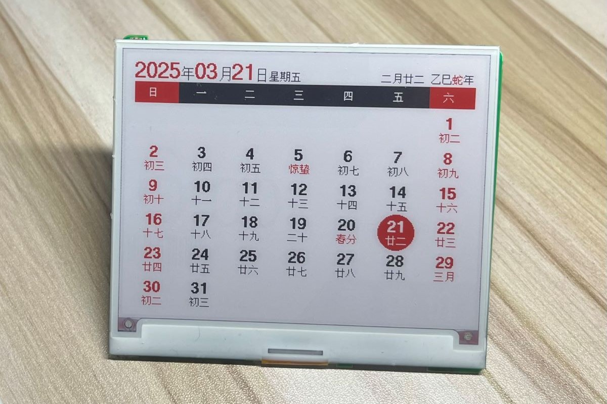

# EPD-nRF5
# 说明： 
#      1. 主分支 工程文件 来自大佬https://tsl0922.github.io/EPD-nRF5 
#      2. 当前分支仅个人维护盒马4.2价签，会在原基础上做修改

电子墨水屏固件，带有一个[网页版上位机](https://github.com/YCD12/EPD-nRF5_DYC/)，可以通过蓝牙传输图像到墨水屏，也可以把墨水屏设置为日历模式（支持农历、节气、节假日调休显示）。

支持的主控芯片有：  `nrf52811` / `nrf52810`，支持的墨水屏驱动有：`UC8176` / `UC8276` / `SSD1619` / `SSD1683` / `JD79668`（黑白/三色/四色墨水屏），同时还支持自定义墨水屏到 MCU 的引脚映射，支持睡眠唤醒（NFC / 无线充电器），支持蓝牙 OTA 固件升级。



## 支持设备

- 盒马 4.2 寸价签，黑白红三色版本

    ```
    MCU：nrf52811
    RAM：24K
    ROM：192K

    驱动：UC8176 (EPD_4in2b_V2)
    屏幕引脚：0A0B0C0D0E0F10
    线圈引脚：09
    LED引脚：03/04/05 （有三个 LED，任选一个使用）
    ```

- 其它基于 `nrf51822` / `nrf51802` / `nrf52811` / `nrf52810` 的价签，理论上都支持

## 上位机

本项目自带一个基于浏览器蓝牙接口实现的网页版上位机，可使用手机或电脑打开下面地址使用，或者在本地直接双击打开 `html/index.html` 来使用。

- 地址：https://github.com/YCD12/EPD-nRF5_DYC
- 演示：https://www.bilibili.com/video/BV1KWAVe1EKs
- 交流群: [389017618](https://qm.qq.com/q/SckzhfDxuu) (点击链接加入群聊)


上位机支持多种图片抖动算法，且可以对图片进行涂鸦、添加文字。除了显示图片作为电子相框外，还可以切换到日历模式，显示月历、农历节气、节假日、放假调休等信息。

## 致谢

- [tsl0922/EPD-nRF5](https://tsl0922.github.io/EPD-nRF5)
- [ZinggJM/GxEPD2](https://github.com/ZinggJM/GxEPD2)
- [waveshareteam/e-Paper](https://github.com/waveshareteam/e-Paper)
- [atc1441/ATC_TLSR_Paper](https://github.com/atc1441/ATC_TLSR_Paper)
